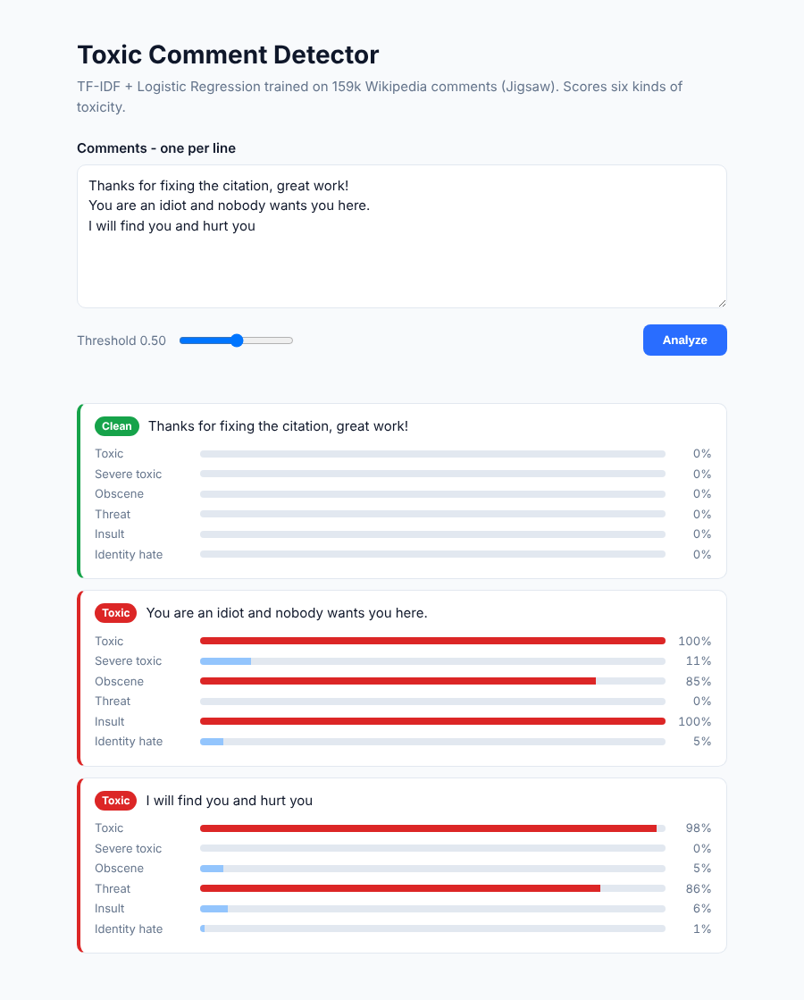
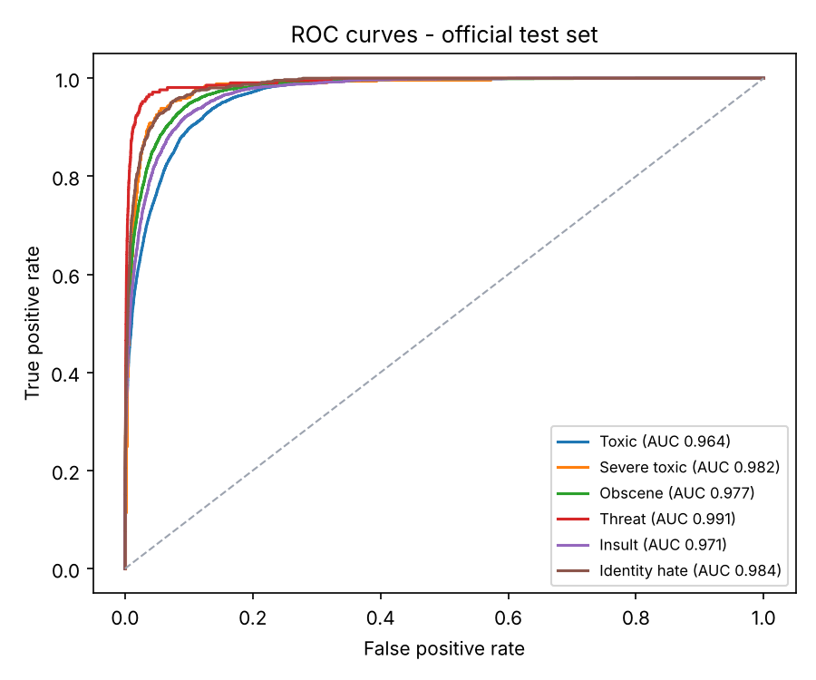
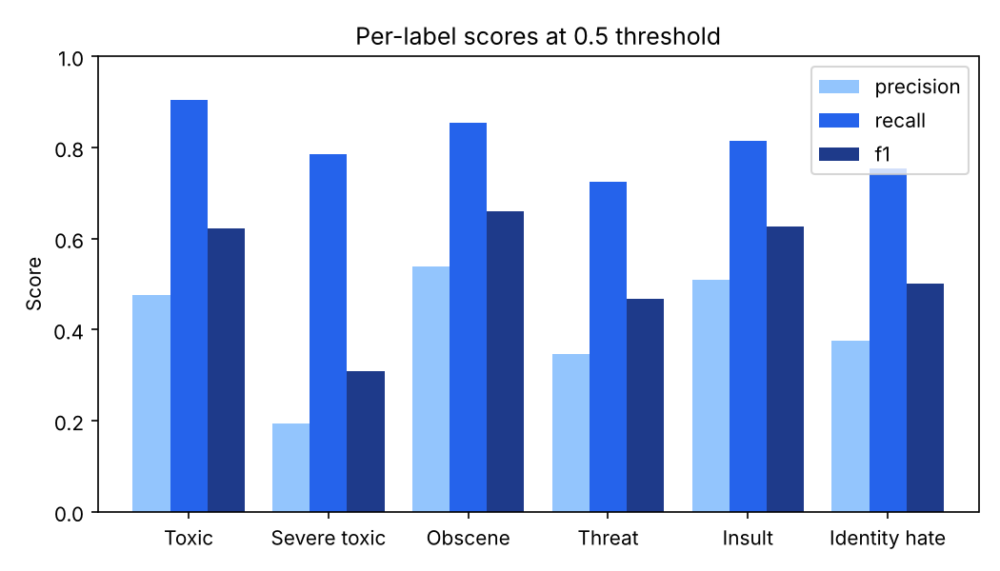

# :speech_balloon: Toxic Comment Detector

A multi-label NLP classifier that scores comments for **six kinds of toxicity** - toxic, severe toxic, obscene, threat, insult and identity hate - with a Flask web app and JSON API.


<p align="center"></p>

---

## :gear: How it works

| Step | Details |
| --- | --- |
| Cleaning | Lowercase, strip URLs and IP addresses. Pronouns are kept on purpose - "you idiot" is a strong signal. |
| Features | TF-IDF on word 1-2 grams (50k) **plus** character 2-5 grams (50k), which catches obfuscated words like "id10t" |
| Model | One Logistic Regression per label (one-vs-rest), class-balanced so rare labels like *threat* aren't ignored |
| Output | A probability per label; a comment is flagged when any label passes the threshold (0.5 by default) |

Trained on **159,571** Wikipedia talk-page comments from the [Jigsaw Toxic Comment Classification Challenge](https://www.kaggle.com/c/jigsaw-toxic-comment-classification-challenge).

---

## :bar_chart: Results

Evaluated on the **official Kaggle test set** (63,978 human-labelled comments the model never saw).

| Metric | Score |
| --- | --- |
| **Mean ROC-AUC** (the competition metric) | **0.978** |
| Any-toxic recall | 0.91 |
| Any-toxic precision | 0.48 |

| Label | ROC-AUC | Precision | Recall | F1 |
| --- | --- | --- | --- | --- |
| Toxic | 0.964 | 0.48 | 0.90 | 0.62 |
| Severe toxic | 0.982 | 0.19 | 0.79 | 0.31 |
| Obscene | 0.977 | 0.54 | 0.86 | 0.66 |
| Threat | 0.992 | 0.35 | 0.73 | 0.47 |
| Insult | 0.971 | 0.51 | 0.82 | 0.63 |
| Identity hate | 0.984 | 0.38 | 0.75 | 0.50 |

<p align="center">
  
  
</p>

**Reading the numbers:** the model ranks comments very well (high AUC). At the default 0.5 threshold it favours **recall** - it catches ~91% of toxic comments but also flags some borderline ones - which suits a moderation queue where a human reviews flagged items. Raise the threshold (slider in the app, or `--threshold`) to trade recall for precision.

---

## :rocket: Run it

```bash
git clone https://github.com/AiMk937/toxic-comment-detector.git
cd toxic-comment-detector
python3 -m venv .venv && source .venv/bin/activate
pip install -r requirements.txt
```

The trained model (`models/toxic_comment_model.joblib`, ~6MB) is included, so you can use it straight away:

| Task | Command |
| --- | --- |
| Launch the web app | `python -m app.app` then open http://127.0.0.1:5000 |
| Score comments in the terminal | `python -m src.predict "great work" "you idiot"` |
| Run the tests | `pytest -q` |
| Retrain and re-evaluate (~10 min) | Download the data (see [data/README.md](data/README.md)), then `python -m src.train` |

### API

```bash
curl -X POST http://127.0.0.1:5000/predict \
  -H "Content-Type: application/json" \
  -d '{"comments": ["you are an idiot"], "threshold": 0.5}'
```

```json
{"predictions": [{"comment": "you are an idiot",
  "scores": {"toxic": 1.0, "severe_toxic": 0.0711, "obscene": 0.9965, "threat": 0.0007, "insult": 1.0, "identity_hate": 0.1868},
  "labels": ["toxic", "obscene", "insult"], "is_toxic": true}]}
```

Requests are capped at 50 comments of 5,000 characters each. `GET /health` reports whether the model loaded.

---

## :file_folder: Project structure

```
toxic-comment-detector/
├── app/
│   ├── app.py                  # Flask app + /predict API
│   ├── templates/index.html
│   └── static/                 # app.js, style.css
├── src/
│   ├── config.py               # paths and label names
│   ├── preprocess.py           # text cleaning
│   ├── model.py                # TF-IDF + Logistic Regression pipeline
│   ├── train.py                # training and test-set evaluation
│   └── predict.py              # ToxicityDetector class + CLI
├── models/                     # trained model
├── reports/                    # metrics.json and charts
├── tests/test_toxicity.py
├── data/README.md              # dataset download steps
└── docs/project_report.docx    # original academic report
```

---

## :crystal_ball: Next steps

- Tune a separate threshold per label on a validation split to lift precision
- Compare with a fine-tuned transformer (e.g. DistilBERT)
- Audit for identity-term bias (e.g. "gay" or "muslim" in neutral sentences)

---

## :busts_in_silhouette: Team

- **Aimaan Khan** (team lead) - [@AiMk937](https://github.com/AiMk937)
- **Mariyum Siddique** - [@Mariyum008](https://github.com/Mariyum008)

## :books: Dataset and license

Jigsaw / Conversation AI, *Toxic Comment Classification Challenge*, Kaggle, 2018. Code released under the [MIT License](LICENSE).
